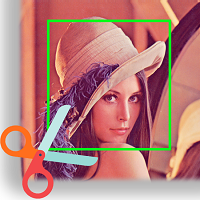

<h1 align="center">
  <br/>Cut And Save Faces
</h1>

<h4 align="center">
Face pic collecting tool
</h4>

<div align="center">
  <a href="https://github.com/Jaesung-Jun/Cut-And-Save-Faces/releases"></a>
  <br>
  <a href="https://pypi.org/project/PyQt5/"></a>
  <a href="https://pypi.org/project/opencv-python/"></a>
  <a href="https://pypi.org/project/opencv-contrib-python/"></a>
  <a href="https://pypi.org/project/dlib/"></a>
  <a href="https://pypi.org/project/imutils/"></a>
  <br>
  <a href="https://raw.githubusercontent.com/Jaesung-Jun/Cut-And-Save-Faces/master/LICENSE"></a>
</div>

## Description
Cut And Save Faces is pictures collecting tool.<br>
Written by Python. (uses Qt to develop its graphical interface)
<div align="center">

<h5> Input </h5>

<br>
<h5> Output (used haarcascade_frontalface_default.xml)</h5>


</div>

## Features
* [ ] support video files
* [x] Face Alignment
* [x] Graphic InterFace
* [ ] Labeling
  
## Requirements

* Ubuntu(Not tested) , macOS(Not tested), Windows
* PyQt5
* Python 3 

## Installation

### dlib install guide

```bash
# You can see dlib install guide at
# https://www.learnopencv.com/install-dlib-on-windows/
```
### Require libraries install
```bash
# opencv-python, opencv-contrib-python, dlib, imutils, PyQt5
# Please note dlib install guide
#
# Develop Environment
#
#  ●  opencv-python==4.1.0.25
#  ●  opencv-contrib-python==4.1.0.25
#  ●  dlib==19.17.0
#  ●  imutils==0.5.3
#  ●  PyQt5==5.14.1
#
# Probably, CASF can be executed with higher versions of libraries.
#
$ pip install opencv-python
$ pip install opencv-contrib-python
$ pip install imutils
$ pip install PyQt5
```

### Execution
```bash
$ python CASF-Main.py
```

## Usage

<div align="center">


</div>

* **(1)** : Select your input path (dataset's path that you want to save&cut )
* **(2)** : Select path where you want to save
* **(3)** : Select output data type you want to save (or select your own detection file)
* **[Option] (3-2)** : select Options
* **(4)** Run

## References
+ **XML & dat Files Reference**
  * https://github.com/opencv/opencv/blob/master/data/
  * https://github.com/nagadomi/lbpcascade_animeface
  * https://github.com/AKSHAYUBHAT/TensorFace/blob/master/openface/models/dlib/shape_predictor_68_face_landmarks.dat
+ **Copyrights**
  * Copyright (C) 2000-2020, Intel Corporation, all rights reserved.
  * Copyright (C) 2009-2011, Willow Garage Inc., all rights reserved.
  * Copyright (C) 2009-2016, NVIDIA Corporation, all rights reserved.
  * Copyright (C) 2010-2013, Advanced Micro Devices, Inc., all rights reserved.
  * Copyright (C) 2015-2016, OpenCV Foundation, all rights reserved.
  * Copyright (C) 2015-2016, Itseez Inc., all rights reserved.
  * Copyright (C) 2019-2020, Xperience AI, all rights reserved.
  * Third party copyrights are property of their respective owners.
  * *Please note https://github.com/opencv/opencv/blob/master/LICENSE before using this software.*


